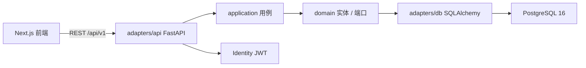

# 01 · 后端开发计划书

规格版本：V1  
对齐前端：`src/app/*`、`src/data/types.ts`、`src/data/index.ts`  
实现位置（后续）：`backend/`（**本轮不创建**）  
技能依据：Clean Architecture 模块化单体（backend-development / architecture-patterns）、REST 契约（api-design-principles）。不做微服务、CQRS、事件溯源、Temporal。

## 1. 目标

把现有 Next.js mock 早报站的数据层换成可部署的 FastAPI 服务：

- 公开只读 API 覆盖全部现有页面
- PostgreSQL 持久化，种子来自当前 mock
- 管理员 JWT 只做登录 / 刷新 / me，给下一阶段写接口留协议
- 契约、表名、错误码以本目录四份文档为准

成功标准：前端用 API client 替换 `src/data` 后，现有 7 个页面的字段、空态、404 语义不变。

## 2. Out of Scope（V1 明确不做）

- 不改 `src/`，不把前端接到 API
- 不建内容 CRUD、不建管理后台页面
- 不抓取、不发外站请求、不上 LLM 聚簇/撰写
- 不做普通用户注册 / 登录 / 收藏 / 订阅
- 不做微服务、CQRS、事件溯源、Temporal、Redis、对象存储
- 不按 `Accept-Language` 裁切双语字段
- 不把脉搏统计改成实时聚合（必须用早报发布时的快照）
- 不为「顺便完整」建 `articles` / `fetch_jobs` / 终端用户表

## 3. 技术栈（锁死）

| 项 | 选择 |
|---|---|
| 语言 | Python 3.12 |
| Web | FastAPI |
| ORM / 迁移 | SQLAlchemy 2.x + Alembic |
| 数据库 | PostgreSQL 16 |
| 密码 | Argon2id |
| JWT | access 15min + refresh 7d 轮转，refresh 只存 SHA-256 hash |
| 文档 | OpenAPI 与 `03-API契约.md` 一致 |
| 时区 | `Asia/Shanghai` |
| 限流 | 进程内（SlowAPI 或等价），单实例 |

同仓独立服务。前端继续 Next.js；后端 CORS 白名单放行前端 origin。

## 4. 架构

模块化单体 + Clean Architecture。依赖向内：adapters → application → domain。四个限界上下文共一个进程、一份 Postgres，**禁止拆微服务**。



限界上下文：

| 上下文 | 职责 | V1 能力 |
|---|---|---|
| Catalog | 专题、信源目录 | 只读 |
| Editorial | 早报、事件簇、时间线、引用、脉搏快照 | 只读 |
| Search | 按簇搜索 | 只读 GET |
| Identity | 管理员、refresh、审计 | login / refresh / logout / me |

跨上下文：Search 读 Editorial + Catalog 的只读端口；Identity 不碰早报表。不要共享 SQLAlchemy model 当领域对象。

后续实现目录（文档约定，本轮不建）：

```
backend/
  app/
    domain/            # 实体、值对象、仓储接口；无 FastAPI / SQLAlchemy
    application/       # 用例：get_today_briefing, search_stories, login...
    adapters/api/      # FastAPI 路由、schema、依赖
    adapters/db/       # SQLAlchemy 模型、仓储实现
  alembic/
  fixtures/            # 从 src/data 导出的 JSON（实现阶段再做）
  tests/
    unit/              # 内存仓储
    integration/       # 真 Postgres
  pyproject.toml
```

测试：用例层用内存仓储；API 层打 PostgreSQL（compose / Testcontainers）。不要用 SQLite 冒充 PG（FTS、IDENTITY、`pg_trgm` 都是 PG 特性）。

## 5. 前端 → API 映射

前端现在全部 `import` 本地 mock，没有 `fetch`。后端契约按这些函数对齐，但早报接口**内嵌** `StorySummary`，避免首页 N+1。

| 前端路由 | 现有函数 | API | 鉴权 |
|---|---|---|---|
| `/`、Footer | `todayBriefing()` + `getStories()` | `GET /api/v1/briefings/today` | 公开 |
| `/d/{date}` | `getBriefing(date)` + `getStories()` | `GET /api/v1/briefings/{date}` | 公开 |
| `/story/{slug}` | `getStory(slug)` | `GET /api/v1/stories/{slug}` | 公开 |
| `/archive` | `listBriefingDates()` + `getBriefing` | `GET /api/v1/briefings?from=&to=` | 公开 |
| `/topics` | `listTopics()` + `storiesByTopic().length` | `GET /api/v1/topics` | 公开 |
| `/topics/{slug}` | `getTopic` + `storiesByTopic` | `GET /api/v1/topics/{slug}` | 公开 |
| `/sources` | `listSources()` | `GET /api/v1/sources` | 公开 |
| `/search` | `searchStories(q)` | `GET /api/v1/search?q=` | 公开 |
| `CURRENT_DATE` | 硬编码 `2026-09-14` | `GET /api/v1/meta` | 公开 |
| （无页面） | — | `POST /api/v1/auth/login\|refresh\|logout` | 登录公开；refresh/logout 持 token |
| （无页面） | — | `GET /api/v1/admin/me` | Bearer access |
| 探活 | — | `GET /healthz`、`GET /readyz` | 公开 |

路由注意：`GET /api/v1/briefings/today` 必须注册在 `/{date}` 之前，`today` 不是日期。

### 5.1 和 mock 函数的差异（允许，且必须这样做）

- `Briefing.mustRead` / `more` 在 mock 里是 slug 数组；API 改为 `StorySummary[]`。前端接 API 时直接渲染，不再二次 `getStories`。
- `CURRENT_DATE` 改为 `meta.currentDate` = **已发布早报的最大 `date`**，不是服务器日历日。种子为 `2026-09-14`。
- 搜索仍返回扁平 `StorySummary[]`（日期降序，其次 must 的 rank）。`今日 / 本周 / 更早` 分组仍由前端用 `meta.currentDate` + 周一做。
- 事件簇页的「置信度」「中英都有」继续由前端按 `sources.length`、`lang` 计算，**不入库、不进 API 额外字段**。
- `updatedAt`、`lastFetch`、时间线 `time`、引用 `time` 对外都是 `HH:mm` 字符串；库内是 `TIMESTAMPTZ`。失败信源 `lastFetch` 为 `"—"`。

### 5.2 页面实际消费的字段

实现阶段 2 换 client 时，这些字段必须在；多返回的字段前端可忽略。

| 页面 | 读哪些 JSON |
|---|---|
| `BriefingView` | `date, updatedAt, title, lede, moreHeading, pulse.*`；must 行：`slug, title, dek, topic.name, sourceNames, sourceCount`；more 行：`slug, title, sourceNames[0], sourceCount` |
| `Footer` | today 的 `updatedAt, mustRead.length, pulse.clusters, pulse.articles, pulse.healthy, pulse.totalSources`；日期用 `meta.currentDate` |
| `/archive` | 列表的 `date, title, mustReadCount, clusters`（日历小字用 `clusters`） |
| `/topics` | `slug, name, blurb, clusterCount` |
| `/topics/{slug}` | `name, blurb`；条目 `slug, title, date, sourceCount` |
| `/story/{slug}` | `date, topic, title, synthesis, timeline, sources[]`（`dek` 对齐类型保留，当前页不展示） |
| `/sources` | `id, name, status, detail`（`lastFetch`/`todayCount` 也要返回，已写进 `detail` 文案） |
| `/search` | 扁平 `items[]`：`slug, title, date, section, rank, sourceCount, topic` |

`Briefing.weekday` 当前 UI 用 `formatLongDate(date)` 现算，API 仍返回，与 `types.ts` 对齐。

### 5.3 响应信封

成功：

```json
{ "data": { } }
```

失败：

```json
{ "error": { "code": "NOT_FOUND", "message": "No briefing for this date." } }
```

- 禁止返回堆栈、SQL、内部表名。
- HTTP 状态与 `error.code` 对照见 `03`、`04`。
- 空日、未知簇、未知专题 → `404 NOT_FOUND`，对齐 `src/app/not-found.tsx`。

双语：所有 `Text` 保持 `{ "zh": "...", "en": "..." }`，与 `src/data/types.ts` 一致。不要拆成两套 locale 端点。

## 6. 领域对象（对外 JSON）

与 `src/data/types.ts` 对齐，并补 V1 需要的摘要型：

| JSON 类型 | 用途 | 对齐 |
|---|---|---|
| `Text` | `{zh,en}` | `types.ts` |
| `Briefing` | 早报详情 | `types.ts` 的 Briefing，但 `mustRead`/`more` 改为 `StorySummary[]` |
| `Story` | 簇详情 | `types.ts` 的 Story，另带 `topic: {slug,name}` |
| `StorySummary` | 列表/早报/搜索 | slug、date、section、rank、title、dek、topic、sourceCount、sourceNames |
| `Topic` | 专题 | `types.ts` + `clusterCount` |
| `Source` | 信源健康 | `types.ts` 的 Source（`id` = `sources.code`） |
| `Meta` | `{ currentDate, timezone }` | 替换硬编码 `CURRENT_DATE` |

`StorySummary.sourceNames`：按引用顺序取最多 3 个 `source_name`，对应 `BriefingView` 的 `sourceLine()`。

## 7. 数据规则

- 只返回 `briefings.status = 'published'` 的早报及其簇。
- 种子全部 `published`。`draft` 列预留，V1 无写接口。
- 脉搏（clusters / articles / zh_en / healthy / total_sources / pulse topics）是**发布快照**。
  - mock 中 `totalSources = 26`，目录只有 12 条信源，禁止用 `COUNT(sources)` 覆盖。
  - `2026-09-14` 的 `clusters = 14`，当天实际只有 11 条 `stories`，禁止用 `COUNT(stories)` 覆盖。
  - 脉搏专题名是展示快照（如「芯片供应」），**不是** `topics` 外键；「芯片供应」≠ 目录 slug `chips`。
- 信源健康页读 `sources` 当前行，不是脉搏快照。
- 引用 `story_citations.source_id` 可空：前端 mock 里 Wired、LMSYS、月之暗面等不在 12 条目录中。
- 对外资源键：早报用 `YYYY-MM-DD`，簇用 kebab `slug`，信源用 `code`。内部 `BIGINT` 不出现在公开 JSON。
- 早期/后期种子簇 slug 公式：`{YYYYMMDD}-{01|02|m}-{topicSlug}`，例如 `20260901-01-research`、`20260901-m-safety`。今日与近况用语义 slug（`claude-memory`）。
- 今日（`2026-09-14`）按 `Story.section` 计：**8 must（rank 1–8）+ 3 more**。`stories-today-more.ts` 里 `llama-41-8b` / `rubin-supply` / `eu-ai-act-phase-2` / `glm-agent-bench` 的 `section` 是 `must`，不是 more。Footer 的 `mustRead.length` 因此是 **8**。

## 8. 实现阶段（后续编码，本轮只记在这里）

### 阶段 1 — 后端可运行（下一编码任务）

1. `backend/` 脚手架、compose Postgres 16、Alembic
2. 按 `02` 建表、角色、索引
3. 从 `src/data` 导出 `backend/fixtures/*.json` 并 seed
4. 实现 `03` 全部公开 GET + health
5. 实现 auth 脚手架（login/refresh/logout/me）+ 登录审计
6. OpenAPI 与契约对拍
7. 种子今日早报响应能驱动现有 `BriefingView` 所需字段

### 阶段 2 — 前端换数据源（另开任务）

`src/data` 改为 API client。本阶段不在 V1 后端范围内。

### 阶段 3 — 管理端 CRUD

复用已有 JWT 与 `admin_users`。需要新契约，不在本文 V1 端点清单里。

### 阶段 4 — 采集管线

使用已预留的 `homepage_url` / `feed_url`。新建 articles/jobs 表。V1 不建这些表，也不发 HTTP 出去。

## 9. 验收清单（给阶段 1 编码用）

- [ ] `GET /api/v1/meta` 的 `currentDate` 等于种子最大发布日 `2026-09-14`
- [ ] `GET /api/v1/briefings/today`：`title.zh` 为「发布周对撞：闭源降价，开源抢榜」；`updatedAt` 为 `07:12`；`pulse` 为 `{clusters:14, articles:86, zhEn:"4 : 3", healthy:24, totalSources:26}`；`mustRead` **8** 条且 `rank` 1..8（`gpt-55-price` 第一；`llama-41-8b` 为 must rank 5，禁止放进 `more`）；`more` **3** 条：`diffusion-lm-code`、`hf-free-tier`、`tongyi-cockpit`
- [ ] `GET /api/v1/briefings/2026-09-01` 200；`/api/v1/briefings/2099-01-01` 404
- [ ] `GET /api/v1/briefings?from=2026-09-01&to=2026-09-14` 返回 14 天，日历格子用快照 `clusters`
- [ ] `GET /api/v1/stories/claude-memory` 含 synthesis/timeline/sources；未知 slug 404
- [ ] `GET /api/v1/topics` 10 条且带 `clusterCount`；`models` 共 **5** 条（含今日 `gpt-55-price`、`claude-memory`）
- [ ] `GET /api/v1/sources` 12 条；`lab-rss` 的 `lastFetch` 为 `"—"`，`status` 为 `bad`
- [ ] `GET /api/v1/search?q=Claude` 命中 `claude-memory`；`q` 超 100 或非法 date/slug 返回 422
- [ ] `SELECT COUNT(*) FROM stories` = 53
- [ ] 登录错误不暴露用户是否存在；refresh 轮转后旧 token 失效
- [ ] SQL 全部参数化；错误 JSON 无堆栈
- [ ] `/healthz` 不碰库；`/readyz` 探 Postgres

## 10. 文档优先级

冲突时：`03` 管字段与状态码，`02` 管列与约束，`04` 管鉴权与限流。本文件管范围和阶段。不得在实现时「顺便」加写接口或采集表。
