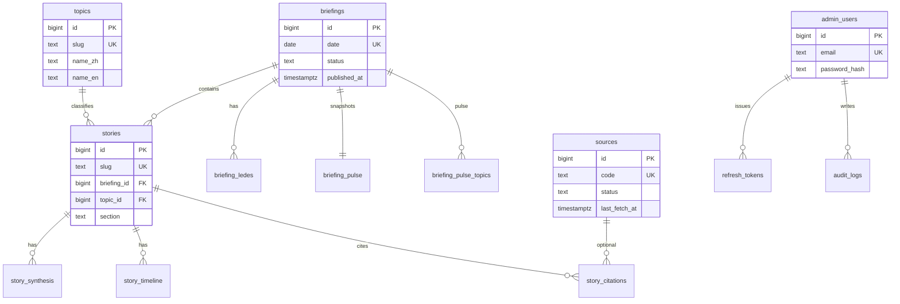

# 02 · 库表设计

数据库：PostgreSQL 16  
规范：3NF 优先；标识 `snake_case`；时间一律 `TIMESTAMPTZ`；字符串 `TEXT` + 长度 CHECK。  
内部 PK：`BIGINT GENERATED ALWAYS AS IDENTITY`。  
对外键：`briefings.date`、`stories.slug`、`sources.code`、`topics.slug`。  
技能依据：postgresql-table-design（FK 手建索引、不用 SERIAL、不用 VARCHAR(n)、小表不分区）。

V1 **不建** articles / fetch_jobs / crawl 表。`sources.homepage_url`、`sources.feed_url` 只预留，不发起请求。

## 1. ERD



## 2. 设计要点

- 脉搏是早报的发布快照，1:1 存在 `briefing_pulse`。禁止用实时 `COUNT` 覆盖：
  - `total_sources`：mock 为 26，目录仅 12 条。
  - `clusters`：`2026-09-14` 快照为 14，当天 `stories` 只有 11 条。
- `briefing_pulse_topics` **没有** `topic_id`。名称是当日报纸上的展示文案（「芯片供应」「政策合规」），不必等于 `topics.name_zh`。
- `story_citations.source_id` 可空，`source_name` 必填。目录外媒体（Wired、LMSYS、月之暗面、Bloomberg、Reuters、财新、晚点等）必须能落库。
- 前端时钟字段（`updatedAt`、`lastFetch`、timeline/citation `time`）入库为 `TIMESTAMPTZ`，API 用上海时区格式化成 `HH:mm`；`last_fetch_at IS NULL` 输出 `"—"`。
- 时间线 `occurred_at` = 早报 `date` + 前端 `HH:mm` + `Asia/Shanghai`。引用 `cited_at` 同规则。
- 中文搜索走 `pg_trgm`；英文搜索走 `to_tsvector('english', ...)`。V1 不装 `zhparser`。
- `UNIQUE` 默认允许多个 NULL；本 schema 的唯一键都是 NOT NULL，无此问题。
- FK 列全部手建 BTree 索引（PG 不会自动给 FK 建索引）。
- 量级：14 天 × 53 簇，**不分区**。
- `stories.rank`：must 必填且 `> 0`；more 为 NULL。种子元组里 more 的 `rank=0` **入库时改成 NULL**，不要把 0 写进去（CHECK 会拒）。

## 3. 角色与扩展（先于建表）

```sql
BEGIN;

CREATE EXTENSION IF NOT EXISTS pg_trgm;

-- 应用角色：实现阶段用环境变量注入密码，禁止把密码写进仓库。
DO $$
BEGIN
  IF NOT EXISTS (SELECT 1 FROM pg_roles WHERE rolname = 'ai_report_app') THEN
    CREATE ROLE ai_report_app LOGIN PASSWORD 'change-me';
  END IF;
  IF NOT EXISTS (SELECT 1 FROM pg_roles WHERE rolname = 'ai_report_migrator') THEN
    CREATE ROLE ai_report_migrator LOGIN PASSWORD 'change-me';
  END IF;
END
$$;

COMMIT;
```

应用连接用 `ai_report_app`（DML）。迁移用 `ai_report_migrator`（DDL）。不要用超级用户跑 FastAPI。角色密码只来自 env / secret，上面 `'change-me'` 仅本地草稿。

## 4. 可执行 DDL 草案

实现时整段放进首个 Alembic revision。顺序不可打乱。

```sql
BEGIN;

CREATE TABLE topics (
  id            BIGINT GENERATED ALWAYS AS IDENTITY PRIMARY KEY,
  slug          TEXT NOT NULL,
  name_zh       TEXT NOT NULL,
  name_en       TEXT NOT NULL,
  blurb_zh      TEXT NOT NULL,
  blurb_en      TEXT NOT NULL,
  sort_order    BIGINT NOT NULL DEFAULT 0,
  is_active     BOOLEAN NOT NULL DEFAULT TRUE,
  created_at    TIMESTAMPTZ NOT NULL DEFAULT now(),
  updated_at    TIMESTAMPTZ NOT NULL DEFAULT now(),
  CONSTRAINT topics_slug_format CHECK (slug ~ '^[a-z0-9]+(?:-[a-z0-9]+)*$'),
  CONSTRAINT topics_slug_len CHECK (LENGTH(slug) BETWEEN 1 AND 64),
  CONSTRAINT topics_name_zh_len CHECK (LENGTH(name_zh) BETWEEN 1 AND 80),
  CONSTRAINT topics_name_en_len CHECK (LENGTH(name_en) BETWEEN 1 AND 80),
  CONSTRAINT topics_blurb_zh_len CHECK (LENGTH(blurb_zh) BETWEEN 1 AND 240),
  CONSTRAINT topics_blurb_en_len CHECK (LENGTH(blurb_en) BETWEEN 1 AND 240)
);
CREATE UNIQUE INDEX topics_slug_uq ON topics (slug);
CREATE INDEX topics_active_sort_idx ON topics (is_active, sort_order, id);

CREATE TABLE sources (
  id                    BIGINT GENERATED ALWAYS AS IDENTITY PRIMARY KEY,
  code                  TEXT NOT NULL,
  name                  TEXT NOT NULL,
  status                TEXT NOT NULL,
  last_fetch_at         TIMESTAMPTZ,
  today_count           BIGINT NOT NULL DEFAULT 0,
  consecutive_failures  BIGINT NOT NULL DEFAULT 0,
  is_quarantined        BOOLEAN NOT NULL DEFAULT FALSE,
  detail_zh             TEXT NOT NULL,
  detail_en             TEXT NOT NULL,
  homepage_url          TEXT,
  feed_url              TEXT,
  created_at            TIMESTAMPTZ NOT NULL DEFAULT now(),
  updated_at            TIMESTAMPTZ NOT NULL DEFAULT now(),
  CONSTRAINT sources_code_format CHECK (code ~ '^[a-z0-9]+(?:-[a-z0-9]+)*$'),
  CONSTRAINT sources_code_len CHECK (LENGTH(code) BETWEEN 1 AND 64),
  CONSTRAINT sources_name_len CHECK (LENGTH(name) BETWEEN 1 AND 120),
  CONSTRAINT sources_status_chk CHECK (status IN ('ok', 'late', 'bad')),
  CONSTRAINT sources_today_count_chk CHECK (today_count >= 0),
  CONSTRAINT sources_fail_chk CHECK (consecutive_failures >= 0),
  CONSTRAINT sources_detail_zh_len CHECK (LENGTH(detail_zh) BETWEEN 1 AND 240),
  CONSTRAINT sources_detail_en_len CHECK (LENGTH(detail_en) BETWEEN 1 AND 240),
  CONSTRAINT sources_homepage_url_len CHECK (homepage_url IS NULL OR LENGTH(homepage_url) <= 500),
  CONSTRAINT sources_feed_url_len CHECK (feed_url IS NULL OR LENGTH(feed_url) <= 500),
  CONSTRAINT sources_homepage_url_proto CHECK (
    homepage_url IS NULL OR homepage_url ~ '^https://'
  ),
  CONSTRAINT sources_feed_url_proto CHECK (
    feed_url IS NULL OR feed_url ~ '^https://'
  )
);
CREATE UNIQUE INDEX sources_code_uq ON sources (code);
CREATE INDEX sources_status_idx ON sources (status);

CREATE TABLE briefings (
  id                 BIGINT GENERATED ALWAYS AS IDENTITY PRIMARY KEY,
  date               DATE NOT NULL,
  weekday_zh         TEXT NOT NULL,
  weekday_en         TEXT NOT NULL,
  title_zh           TEXT NOT NULL,
  title_en           TEXT NOT NULL,
  more_heading_zh    TEXT NOT NULL,
  more_heading_en    TEXT NOT NULL,
  status             TEXT NOT NULL DEFAULT 'published',
  published_at       TIMESTAMPTZ NOT NULL,
  created_at         TIMESTAMPTZ NOT NULL DEFAULT now(),
  updated_at         TIMESTAMPTZ NOT NULL DEFAULT now(),
  CONSTRAINT briefings_title_zh_len CHECK (LENGTH(title_zh) BETWEEN 1 AND 200),
  CONSTRAINT briefings_title_en_len CHECK (LENGTH(title_en) BETWEEN 1 AND 200),
  CONSTRAINT briefings_weekday_zh_len CHECK (LENGTH(weekday_zh) BETWEEN 1 AND 16),
  CONSTRAINT briefings_weekday_en_len CHECK (LENGTH(weekday_en) BETWEEN 1 AND 16),
  CONSTRAINT briefings_more_zh_len CHECK (LENGTH(more_heading_zh) BETWEEN 1 AND 80),
  CONSTRAINT briefings_more_en_len CHECK (LENGTH(more_heading_en) BETWEEN 1 AND 80),
  CONSTRAINT briefings_status_chk CHECK (status IN ('draft', 'published'))
);
CREATE UNIQUE INDEX briefings_date_uq ON briefings (date);
CREATE INDEX briefings_published_idx ON briefings (status, date DESC);

CREATE TABLE briefing_ledes (
  id            BIGINT GENERATED ALWAYS AS IDENTITY PRIMARY KEY,
  briefing_id   BIGINT NOT NULL REFERENCES briefings (id) ON DELETE CASCADE,
  sort_order    BIGINT NOT NULL,
  text_zh       TEXT NOT NULL,
  text_en       TEXT NOT NULL,
  CONSTRAINT briefing_ledes_sort_chk CHECK (sort_order >= 0),
  CONSTRAINT briefing_ledes_zh_len CHECK (LENGTH(text_zh) BETWEEN 1 AND 400),
  CONSTRAINT briefing_ledes_en_len CHECK (LENGTH(text_en) BETWEEN 1 AND 400),
  CONSTRAINT briefing_ledes_order_uq UNIQUE (briefing_id, sort_order)
);
CREATE INDEX briefing_ledes_briefing_idx ON briefing_ledes (briefing_id);

CREATE TABLE briefing_pulse (
  briefing_id     BIGINT PRIMARY KEY REFERENCES briefings (id) ON DELETE CASCADE,
  clusters        BIGINT NOT NULL,
  articles        BIGINT NOT NULL,
  zh_en           TEXT NOT NULL,
  healthy         BIGINT NOT NULL,
  total_sources   BIGINT NOT NULL,
  CONSTRAINT briefing_pulse_clusters_chk CHECK (clusters >= 0),
  CONSTRAINT briefing_pulse_articles_chk CHECK (articles >= 0),
  CONSTRAINT briefing_pulse_healthy_chk CHECK (healthy >= 0),
  CONSTRAINT briefing_pulse_total_chk CHECK (total_sources >= 0),
  CONSTRAINT briefing_pulse_health_le_total CHECK (healthy <= total_sources),
  CONSTRAINT briefing_pulse_zh_en_len CHECK (LENGTH(zh_en) BETWEEN 1 AND 32)
);

CREATE TABLE briefing_pulse_topics (
  id            BIGINT GENERATED ALWAYS AS IDENTITY PRIMARY KEY,
  briefing_id   BIGINT NOT NULL REFERENCES briefings (id) ON DELETE CASCADE,
  sort_order    BIGINT NOT NULL,
  name_zh       TEXT NOT NULL,
  name_en       TEXT NOT NULL,
  count         BIGINT NOT NULL,
  CONSTRAINT briefing_pulse_topics_sort_chk CHECK (sort_order >= 0),
  CONSTRAINT briefing_pulse_topics_count_chk CHECK (count >= 0),
  CONSTRAINT briefing_pulse_topics_name_zh_len CHECK (LENGTH(name_zh) BETWEEN 1 AND 80),
  CONSTRAINT briefing_pulse_topics_name_en_len CHECK (LENGTH(name_en) BETWEEN 1 AND 80),
  CONSTRAINT briefing_pulse_topics_order_uq UNIQUE (briefing_id, sort_order)
);
CREATE INDEX briefing_pulse_topics_briefing_idx ON briefing_pulse_topics (briefing_id);

CREATE TABLE stories (
  id            BIGINT GENERATED ALWAYS AS IDENTITY PRIMARY KEY,
  slug          TEXT NOT NULL,
  briefing_id   BIGINT NOT NULL REFERENCES briefings (id) ON DELETE RESTRICT,
  topic_id      BIGINT NOT NULL REFERENCES topics (id) ON DELETE RESTRICT,
  section       TEXT NOT NULL,
  rank          BIGINT,
  title_zh      TEXT NOT NULL,
  title_en      TEXT NOT NULL,
  dek_zh        TEXT NOT NULL,
  dek_en        TEXT NOT NULL,
  created_at    TIMESTAMPTZ NOT NULL DEFAULT now(),
  updated_at    TIMESTAMPTZ NOT NULL DEFAULT now(),
  search_zh     TEXT GENERATED ALWAYS AS (slug || ' ' || title_zh || ' ' || dek_zh) STORED,
  search_en     TEXT GENERATED ALWAYS AS (slug || ' ' || title_en || ' ' || dek_en) STORED,
  search_en_tsv TSVECTOR GENERATED ALWAYS AS (
                  to_tsvector('english', title_en || ' ' || dek_en)
                ) STORED,
  CONSTRAINT stories_slug_format CHECK (slug ~ '^[a-z0-9]+(?:-[a-z0-9]+)*$'),
  CONSTRAINT stories_slug_len CHECK (LENGTH(slug) BETWEEN 1 AND 80),
  CONSTRAINT stories_section_chk CHECK (section IN ('must', 'more')),
  CONSTRAINT stories_rank_chk CHECK (rank IS NULL OR rank > 0),
  CONSTRAINT stories_must_rank_chk CHECK (
    (section = 'must' AND rank IS NOT NULL) OR (section = 'more')
  ),
  CONSTRAINT stories_title_zh_len CHECK (LENGTH(title_zh) BETWEEN 1 AND 200),
  CONSTRAINT stories_title_en_len CHECK (LENGTH(title_en) BETWEEN 1 AND 200),
  CONSTRAINT stories_dek_zh_len CHECK (LENGTH(dek_zh) BETWEEN 1 AND 400),
  CONSTRAINT stories_dek_en_len CHECK (LENGTH(dek_en) BETWEEN 1 AND 400)
);
CREATE UNIQUE INDEX stories_slug_uq ON stories (slug);
CREATE INDEX stories_briefing_section_rank_idx ON stories (briefing_id, section, rank);
CREATE INDEX stories_topic_id_idx ON stories (topic_id, id DESC);
CREATE INDEX stories_search_zh_trgm_idx ON stories USING GIN (search_zh gin_trgm_ops);
CREATE INDEX stories_search_en_trgm_idx ON stories USING GIN (search_en gin_trgm_ops);
CREATE INDEX stories_search_en_tsv_idx ON stories USING GIN (search_en_tsv);

CREATE TABLE story_synthesis (
  id            BIGINT GENERATED ALWAYS AS IDENTITY PRIMARY KEY,
  story_id      BIGINT NOT NULL REFERENCES stories (id) ON DELETE CASCADE,
  sort_order    BIGINT NOT NULL,
  text_zh       TEXT NOT NULL,
  text_en       TEXT NOT NULL,
  CONSTRAINT story_synthesis_sort_chk CHECK (sort_order >= 0),
  CONSTRAINT story_synthesis_zh_len CHECK (LENGTH(text_zh) BETWEEN 1 AND 2000),
  CONSTRAINT story_synthesis_en_len CHECK (LENGTH(text_en) BETWEEN 1 AND 2000),
  CONSTRAINT story_synthesis_order_uq UNIQUE (story_id, sort_order)
);
CREATE INDEX story_synthesis_story_idx ON story_synthesis (story_id);

CREATE TABLE story_timeline (
  id            BIGINT GENERATED ALWAYS AS IDENTITY PRIMARY KEY,
  story_id      BIGINT NOT NULL REFERENCES stories (id) ON DELETE CASCADE,
  sort_order    BIGINT NOT NULL,
  occurred_at   TIMESTAMPTZ NOT NULL,
  text_zh       TEXT NOT NULL,
  text_en       TEXT NOT NULL,
  CONSTRAINT story_timeline_sort_chk CHECK (sort_order >= 0),
  CONSTRAINT story_timeline_zh_len CHECK (LENGTH(text_zh) BETWEEN 1 AND 400),
  CONSTRAINT story_timeline_en_len CHECK (LENGTH(text_en) BETWEEN 1 AND 400),
  CONSTRAINT story_timeline_order_uq UNIQUE (story_id, sort_order)
);
CREATE INDEX story_timeline_story_idx ON story_timeline (story_id, sort_order);

CREATE TABLE story_citations (
  id            BIGINT GENERATED ALWAYS AS IDENTITY PRIMARY KEY,
  story_id      BIGINT NOT NULL REFERENCES stories (id) ON DELETE CASCADE,
  source_id     BIGINT REFERENCES sources (id) ON DELETE SET NULL,
  source_name   TEXT NOT NULL,
  lang          TEXT NOT NULL,
  kind_zh       TEXT NOT NULL,
  kind_en       TEXT NOT NULL,
  cited_at      TIMESTAMPTZ NOT NULL,
  sort_order    BIGINT NOT NULL,
  CONSTRAINT story_citations_sort_chk CHECK (sort_order >= 0),
  CONSTRAINT story_citations_lang_chk CHECK (lang IN ('zh', 'en')),
  CONSTRAINT story_citations_name_len CHECK (LENGTH(source_name) BETWEEN 1 AND 120),
  CONSTRAINT story_citations_kind_zh_len CHECK (LENGTH(kind_zh) BETWEEN 1 AND 32),
  CONSTRAINT story_citations_kind_en_len CHECK (LENGTH(kind_en) BETWEEN 1 AND 32),
  CONSTRAINT story_citations_order_uq UNIQUE (story_id, sort_order)
);
CREATE INDEX story_citations_story_idx ON story_citations (story_id, sort_order);
CREATE INDEX story_citations_source_idx ON story_citations (source_id);

CREATE TABLE admin_users (
  id              BIGINT GENERATED ALWAYS AS IDENTITY PRIMARY KEY,
  email           TEXT NOT NULL,
  password_hash   TEXT NOT NULL,
  is_active       BOOLEAN NOT NULL DEFAULT TRUE,
  created_at      TIMESTAMPTZ NOT NULL DEFAULT now(),
  last_login_at   TIMESTAMPTZ,
  CONSTRAINT admin_users_email_len CHECK (LENGTH(email) BETWEEN 3 AND 254),
  CONSTRAINT admin_users_email_format CHECK (email ~ '^[^@]+@[^@]+$'),
  CONSTRAINT admin_users_hash_len CHECK (LENGTH(password_hash) BETWEEN 20 AND 255)
);
CREATE UNIQUE INDEX admin_users_email_lower_uq ON admin_users (LOWER(email));

CREATE TABLE refresh_tokens (
  id              BIGINT GENERATED ALWAYS AS IDENTITY PRIMARY KEY,
  admin_user_id   BIGINT NOT NULL REFERENCES admin_users (id) ON DELETE CASCADE,
  token_hash      TEXT NOT NULL,
  expires_at      TIMESTAMPTZ NOT NULL,
  revoked_at      TIMESTAMPTZ,
  created_at      TIMESTAMPTZ NOT NULL DEFAULT now(),
  user_agent      TEXT,
  ip              INET,
  CONSTRAINT refresh_tokens_hash_len CHECK (LENGTH(token_hash) = 64),
  CONSTRAINT refresh_tokens_ua_len CHECK (user_agent IS NULL OR LENGTH(user_agent) <= 300)
);
CREATE UNIQUE INDEX refresh_tokens_hash_uq ON refresh_tokens (token_hash);
CREATE INDEX refresh_tokens_user_idx ON refresh_tokens (admin_user_id);
CREATE INDEX refresh_tokens_active_idx ON refresh_tokens (admin_user_id, expires_at)
  WHERE revoked_at IS NULL;

CREATE TABLE audit_logs (
  id            BIGINT GENERATED ALWAYS AS IDENTITY PRIMARY KEY,
  actor_id      BIGINT REFERENCES admin_users (id) ON DELETE SET NULL,
  action        TEXT NOT NULL,
  resource      TEXT NOT NULL,
  ip            INET,
  user_agent    TEXT,
  metadata      JSONB NOT NULL DEFAULT '{}'::jsonb,
  created_at    TIMESTAMPTZ NOT NULL DEFAULT now(),
  CONSTRAINT audit_logs_action_len CHECK (LENGTH(action) BETWEEN 1 AND 64),
  CONSTRAINT audit_logs_resource_len CHECK (LENGTH(resource) BETWEEN 1 AND 128),
  CONSTRAINT audit_logs_ua_len CHECK (user_agent IS NULL OR LENGTH(user_agent) <= 300)
);
CREATE INDEX audit_logs_created_idx ON audit_logs (created_at DESC);
CREATE INDEX audit_logs_actor_idx ON audit_logs (actor_id, created_at DESC);

COMMIT;
```

`refresh_tokens.token_hash` 存 SHA-256 hex（64 字符），**禁止存明文 refresh**。`admin_users.password_hash` 存 Argon2id。`audit_logs` 只追加，V1 应用层不提供 UPDATE/DELETE。

`search_zh` / `search_en` 把 `slug` 拼进去，对齐前端 `searchStories()` 的 haystack（含 slug）。

## 5. 权限

```sql
GRANT CONNECT ON DATABASE ai_report TO ai_report_app;
GRANT USAGE ON SCHEMA public TO ai_report_app;

GRANT SELECT, INSERT, UPDATE, DELETE ON
  topics, sources, briefings, briefing_ledes, briefing_pulse, briefing_pulse_topics,
  stories, story_synthesis, story_timeline, story_citations,
  admin_users, refresh_tokens
TO ai_report_app;

GRANT SELECT, INSERT ON audit_logs TO ai_report_app;
REVOKE UPDATE, DELETE ON audit_logs FROM ai_report_app;

GRANT USAGE, SELECT ON ALL SEQUENCES IN SCHEMA public TO ai_report_app;
```

V1 虽无内容写接口，app 角色仍给 DML：seed 脚本与 refresh 轮转需要。不要给 `ai_report_app` 任何 DDL。`GRANT CONNECT ON DATABASE` 在建库后由超级用户执行，不要塞进应用启动路径。

## 6. 搜索怎么查

公开搜索用例（对齐 `src/data/index.ts` 的 `searchStories`）：

1. 规范化 `q`：先去掉 ASCII 控制字符（U+0000–U+001F、U+007F），再 trim，最长 100。缺参数或超长 → 422；全空白 → 不查库，返回空列表。
2. 中文/模糊：`search_zh % q OR search_en % q`（`pg_trgm`，已含 slug/title/dek）。
3. 英文词：`search_en_tsv @@ plainto_tsquery('english', q)`。**禁止**把用户输入送进 `to_tsquery`。
4. 额外 OR：`EXISTS` 命中 `story_synthesis` 中英、`story_citations.source_name`、`topics.name_zh|name_en`。
5. 只返回所属 briefing `status = 'published'` 的簇。
6. 排序：`briefings.date DESC`，其次 `section='must'` 优先，再次 `rank NULLS LAST`，最后 `stories.id`。

不要把 synthesis 冗余进 `stories` 宽列。标题+dek+slug 的 generated 列够索引；synthesis 走 EXISTS 即可（V1 数据量小）。

## 7. 种子策略

实现阶段（非本轮）从 `src/data` 导出 JSON 到 `backend/fixtures/`：

| 文件 | 来源 | 期望条数 |
|---|---|---|
| `topics.json` | `src/data/topics.ts` 的 `topics` | 10 |
| `sources.json` | `src/data/topics.ts` 的 `sources` | 12 |
| `briefings.json` | `briefingMeta`（early + late） | 14（`2026-09-01` … `2026-09-14`） |
| `stories.json` | 全部 `stories-*.ts` | **53** |
| `admin.json` | 环境变量生成，不进 git | 1 |

53 条拆分：

| 文件 | 条数 | slug 形态 |
|---|---|---|
| `stories-today.ts` | 4 must | rank 1–4：`gpt-55-price`, `claude-memory`, `kimi-open-weights`, `gemini-robotics-2` |
| `stories-today-more.ts` | **4 must + 3 more** | must rank 5–8：`llama-41-8b`, `rubin-supply`, `eu-ai-act-phase-2`, `glm-agent-bench`；more：`diffusion-lm-code`, `hf-free-tier`, `tongyi-cockpit`。**不要被文件名骗了。** |
| `stories-recent.ts` | 7 | `ide-local-8b`, `copilot-multirepo`, `laptop-quant-8b`, `code-stays-on-device`, `offline-terminal-agent`, `anthropic-retention`, `memory-privacy-papers` |
| `stories-seeds.ts` | 21 | `{YYYYMMDD}-{01\|02\|m}-{topic}`，`2026-09-01`…`07` 每天 3 条 |
| `stories-seeds-late.ts` | 14 | 同上，`2026-09-08`…`12`（11 日只有 2 条种子，另 2 条在 recent） |

映射：

- `Source.id` → `sources.code`（如 `openai-blog`、`lab-rss`）
- `Story.date` → `briefings.date` → `stories.briefing_id`
- `Story.topicSlug` → `topics.slug` → `stories.topic_id`
- `Story.sources[]` → `story_citations`；能匹配 `sources.name` 则填 `source_id`，否则 `source_id` 为空
- `lastFetch: "—"` → `last_fetch_at NULL`，`is_quarantined TRUE`，`consecutive_failures = 2`（`lab-rss`）
- `status: "late"`：`qbitai`、`36kr`，照抄 mock
- `lastFetch: "06:12"` → 当天（seed 用 `2026-09-14`）+ `06:12` + 上海时区
- `Briefing.updatedAt: "07:12"` → `published_at = date + 07:12 + Asia/Shanghai`
- `pulse.zhEn` → `briefing_pulse.zh_en`（原样文本，如 `"4 : 3"`）
- `pulse.totalSources` / `pulse.clusters` 原样写入
- more 段 `rank` 缺省或 0 → 列值 NULL（今日 more 三件都没有 rank）
- 管理员 email/password 只来自 env（`ADMIN_EMAIL` / `ADMIN_PASSWORD`），hash 后写入；fixtures 不含明文密码
- V1 `homepage_url` / `feed_url` 全部 NULL
- **插入顺序**必须与 `src/data/catalog.ts` 的 `stories` 数组一致，这样 more 段 `ORDER BY id ASC` 与前端 `getBriefing().more` 顺序一致

专题 `sort_order` 按 `topics.ts` 数组下标 0..9。种子后 `clusterCount`（published 簇）必须等于：

| slug | count |
|---|---:|
| `models` | 5 |
| `open-source` | 10 |
| `agents` | 5 |
| `chips` | 6 |
| `policy` | 6 |
| `robotics` | 2 |
| `on-device` | 5 |
| `industry-cn` | 4 |
| `research` | 3 |
| `safety` | 7 |

合计 53。

Seed 幂等：按 `slug` / `date` / `code` upsert。可重复跑。

种子后自检：

- `SELECT COUNT(*) FROM briefings` = 14
- `SELECT COUNT(*) FROM stories` = 53
- `SELECT COUNT(*) FROM topics` = 10
- `SELECT COUNT(*) FROM sources` = 12
- `SELECT MAX(date) FROM briefings WHERE status='published'` = `2026-09-14`
- `lab-rss`：`status='bad'` 且 `last_fetch_at IS NULL` 且 `is_quarantined`
- `claude-memory` 存在且 `section='must'` 且 `rank=2`
- `llama-41-8b` 存在且 `section='must'` 且 `rank=5`（不是 more）
- `diffusion-lm-code` 存在且 `section='more'` 且 `rank IS NULL`
- `SELECT COUNT(*) FROM stories s JOIN briefings b ON b.id = s.briefing_id WHERE b.date = '2026-09-14' AND s.section = 'must'` = 8
- `SELECT COUNT(*) FROM stories s JOIN briefings b ON b.id = s.briefing_id WHERE b.date = '2026-09-14' AND s.section = 'more'` = 3
- `20260901-01-research` 存在
- `SELECT clusters, total_sources FROM briefing_pulse JOIN briefings USING (briefing_id) WHERE date='2026-09-14'` → `14, 26`

## 8. 以后才能加的表（V1 禁止创建）

- `articles`、`fetch_runs`、`raw_payloads`、`cluster_jobs`
- 终端用户 `users` / `favorites`

阶段 3/4 另开迁移。不要为「顺便完整」在 V1 建空表。
