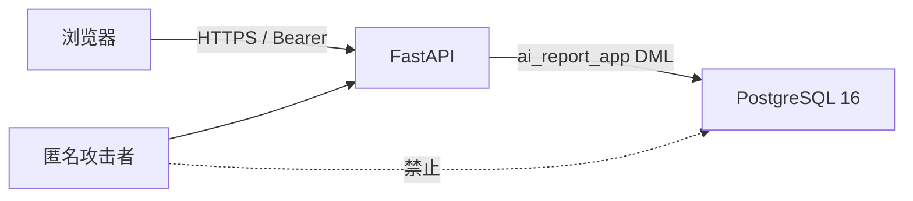

# 04 · API 安全设计

适用：V1 FastAPI 公开只读 API + 管理员 JWT 脚手架。  
对齐：`01-后端开发计划书.md`、`02-库表设计.md`、`03-API契约.md`。  
技能依据：backend-api-security（输入 allowlist、参数化查询、JWT + refresh 轮转、限流、安全头、CORS 白名单、错误不泄漏、DB 最小权限、出网 SSRF 预留）。不做微服务网关、WAF、mTLS。

内容写接口、抓取、LLM **不在范围**；`sources.homepage_url` / `feed_url` 仍按「将来会出网」约束。

## 0. 与 01 / 03 锁死的硬约束

| 项 | 值 |
|---|---|
| 公开 GET | 不解析 `Authorization`。带坏 token 的 GET 仍 200 |
| 写资源 | V1 **不注册** briefing/story/topic/source 的 POST/PATCH/DELETE |
| Access JWT | 900 秒（15 min），`expiresIn: 900` |
| Refresh | 7 天，只存 SHA-256 hex；每次 refresh 轮转 |
| 登录失败 | 一律 401 `Invalid credentials.`（含不存在邮箱、错密码、停用账号） |
| 停用账号 | login 走 401；已持有效 access 调 `/admin/me` 走 403 `Account disabled.` |
| HTTP 409 | **禁止**。refresh 重放与未知同一 401 |
| 限流 | GET 60/min/IP，search 10/min/IP，login 5/min/IP，refresh 20/min/IP；进程内，单实例 |
| CORS | 白名单，开发默认 `http://localhost:3000`，禁止 `*` |
| 错误体 | `{ "error": { "code", "message" } }`，无堆栈、无 SQL、无内部表名 |
| DB 角色 | 应用 `ai_report_app` 只有 DML；迁移 `ai_report_migrator` |
| 出网 | V1 不发外站请求 |

冲突时：状态码与文案以 `03` 为准，本文件管怎么防。

## 1. 威胁模型

资产：早报内容（公开）、管理员凭证、refresh token、数据库、环境变量里的密钥。  
信任边界：浏览器 / 前端 origin → API；API → PostgreSQL。V1 不访问外站。



| 威胁 | 攻击面 | 控制 | V1 落地 |
|---|---|---|---|
| SQL 注入 | query / path / body / 搜索 `q` | 只走 SQLAlchemy 参数绑定；禁止 f-string 拼 SQL；搜索用 `plainto_tsquery`，禁止 `to_tsquery` | 必须 |
| tsquery / LIKE 注入 | `GET /search?q=` | 去控制字符、最长 100；`%` / `_` 当普通字面量（trgm 模糊），不要自己拼 `LIKE '%'+q+'%'` 不转义 | 必须 |
| 输入炸弹 | `q`、slug、date、JSON body | allowlist；JSON 体上限 8KB；`q` 去掉控制字符后再量长度 | 必须 |
| 登录爆破 | `POST /auth/login` | 5/min/IP；成功失败同一 401 文案；Argon2id | 必须 |
| 用户枚举 | login 的邮箱 | 不存在邮箱也对 **固定 dummy Argon2 hash** 做一次 verify，耗时对齐；文案不区分 | 必须 |
| 停用账号枚举 | login | 停用账号 login 仍 401 `Invalid credentials.`，不在登录口返回 403 | 必须 |
| Refresh 盗窃 / 重放 | `POST /auth/refresh` | 只存 SHA-256；轮转即 `revoked_at`；未知/过期/已撤销同一 401，不用 409 | 必须 |
| JWT 算法混淆 | access | 校验时 **钉死** 算法（RS256 或 HS256）；拒绝 `alg=none`、拒绝 header 里的算法协商 | 必须 |
| Token 进 URL | 日志、Referer | 禁止从 query 读 token；只认 `Authorization: Bearer` 或 JSON body | 必须 |
| 未授权写 | 未来 CRUD | V1 **不注册** 写路由；JWT 只开 login/refresh/logout/me | 必须 |
| IDOR / 内部 id 泄漏 | JSON、path | 公开资源键只有 date / slug / source.code；JSON 不出现 BIGINT PK；`Source.id` 是 code 字符串 | 必须 |
| Draft 泄漏 | 早报查询 | 公开查询强制 `briefings.status = 'published'` | 必须 |
| 信息泄漏 | 500、OpenAPI、日志 | 统一信封、无堆栈；生产 `DEBUG=false`；`/docs` 默认关 | 必须 |
| SSRF | `homepage_url` / `feed_url` | CHECK 仅 `https://`；V1 无出网 client；选择器不读这两列 | 必须（约束） |
| 抓取滥用 | 公开 GET、搜索 | IP 限流；搜索更严 | 必须 |
| CORS 过宽 | 浏览器 | 精确 origin 白名单；`allow_credentials=false` | 必须 |
| 点击劫持 / MIME 嗅探 | 响应头 | `X-Frame-Options: DENY`、`nosniff`、`Referrer-Policy: no-referrer` | 必须 |
| 日志注入 / 密钥入日志 | stdout | 结构化日志；password / token / Authorization 一律 `[redacted]` | 必须 |
| 主机头攻击 | 反向代理 | 不根据 `Host` 拼绝对 URL；CORS origin 只来自 env 白名单 | 必须 |
| Mass assignment | 无写接口 | V1 无 PATCH body 进 ORM；阶段 3 必须显式 allowlist 字段 | 预留 |
| CSRF | 状态变化 | V1 无 cookie session，Bearer only，不接 CSRF token | 记录 |

不在 V1：WAF、多实例分布式限流、mTLS、用户 MFA、RLS、家庭级 refresh 一锅端。阶段 3 再加。

## 2. 鉴权

### 2.1 谁可以做什么

| 端点 | 身份 |
|---|---|
| `GET /healthz` `/readyz` 以及全部公开只读 `GET /api/v1/*` | 匿名 |
| `POST /api/v1/auth/login` | 匿名 + 5/min/IP |
| `POST /api/v1/auth/refresh` | 持有效 refresh（body，不是 Bearer） |
| `POST /api/v1/auth/logout` | access **或** refresh，至少一种 |
| `GET /api/v1/admin/me` | 有效 access 且 `is_active=true` |

没有终端用户角色。只有 `admin_users`。公开 JSON 永不带 `password_hash` / `token_hash` / 内部 id。

### 2.2 JWT access

- 算法：优先 **RS256**（`JWT_PRIVATE_KEY_PATH` + `JWT_PUBLIC_KEY_PATH`）；若未配置 RSA 密钥则 **HS256**（`JWT_SECRET`，≥32 字节随机）。两种模式互斥，启动时校验恰好一种配齐，否则拒绝启动。
- 解码：**显式传入算法列表**，不要让库按 header `alg` 自行选择。
- 声明：`sub` = admin 内部 id 的十进制字符串、`email`、`typ=access`、`iat`、`exp`、`jti`
- TTL：900 秒，与响应 `expiresIn: 900` 一致
- 校验：签名、exp、typ=access。过期/坏签/错 typ 一律 401 `UNAUTHORIZED`，文案 `Invalid access token.`
- 时钟偏移：允许 ±30 秒
- 停用账号：`/admin/me` 查库 `is_active`，false → 403 `FORBIDDEN` / `Account disabled.`
- Access **不入库**（无状态）。吊销靠短 TTL + refresh 黑名单。
- 禁止把 JWT 放进 query、日志、OpenAPI 示例。

公开 GET **不要**解析 Authorization。

### 2.3 Refresh

- 生成：`secrets.token_urlsafe(32)` 及以上
- 存储：`sha256(token)` hex 64 字符 → `refresh_tokens.token_hash`。**禁止存明文**
- TTL：7 天
- 轮转：refresh 成功后旧行 `revoked_at=now()`，插入新 hash；响应只回一次新明文
- 响应形状同 login（见 `03`）
- 未知 / 过期 / 已撤销：401 `Invalid refresh token.`，不区分原因，**不用 409**
- V1 重放检测：已撤销 hash 再来只 401，不级联作废该用户全部 token（阶段 3 可加 family revoke）
- 日志只记 hash 前 8 位或完全不记；`ip` / `user_agent` 截断后入库

### 2.4 密码

- Argon2id，salt 内嵌在 hash（`passlib[argon2]` 或 `argon2-cffi`）
- 登录时序：
  1. 规范化 email：trim + `LOWER`
  2. 按 `LOWER(email)` 查 `admin_users`
  3. **找不到**：对启动时生成的 **dummy Argon2id hash**（常量，进程内固定）做一次 `verify`，然后 401
  4. **找到但 `is_active=false`**：仍做一次真实 hash verify，然后 401 `Invalid credentials.`（登录口不暴露停用）
  5. **找到且 active、密码错**：verify 失败 → 同一 401
  6. **成功**：发 access + refresh，写 `audit_logs.login`，更新 `last_login_at`
- Dummy hash 不得等于任何真实用户 hash；只为对齐耗时
- 密码策略：seed 时最少 12 字符（env `ADMIN_PASSWORD`）。login 入口只限制非空且 ≤ 256，避免给攻击者提示策略
- 禁止日志、错误、审计 metadata 出现 password

### 2.5 审计

V1 必写 `audit_logs`（应用角色对该表只有 INSERT/SELECT）：

| action | 何时 |
|---|---|
| `login` | 登录成功 |
| `login_failed` | 登录失败（含不存在邮箱、停用、错密码） |
| `refresh` | 刷新成功 |
| `logout` | 登出 |

`resource` 用 `auth`。`metadata` 可含 `email`，禁止 token/password。`ip`、`user_agent` 截断到列 CHECK 长度。

## 3. 限流

V1 进程内计数（SlowAPI 或等价内存桶）。**只对单实例有效**；多副本会按实例放大配额，文档与 README 已写死 V1 无 Redis。超限：

```json
{ "error": { "code": "RATE_LIMITED", "message": "Too many requests." } }
```

HTTP 429。响应头：`Retry-After`（秒）。`error.message` 不要回「还剩几次」。

| 范围 | 配额 | 键 |
|---|---|---|
| 默认 GET `/api/v1/*` | 60 / 分钟 / IP | 客户端 IP |
| `GET /api/v1/search` | 10 / 分钟 / IP | 覆盖默认 |
| `POST /api/v1/auth/login` | 5 / 分钟 / IP | 覆盖默认 |
| `POST /api/v1/auth/refresh` | 20 / 分钟 / IP | 覆盖默认 |
| `POST /api/v1/auth/logout`、`GET /api/v1/admin/me` | 走默认 60 | IP |
| `/healthz` `/readyz` | 不限流 | — |

IP 取自反向代理设置的 `X-Forwarded-For` **最左**仅当 `TRUST_PROXY=true`；否则用 socket IP，防止伪造。

限流发生在鉴权之前（login 未登录也要限）。429 仍走统一信封。

## 4. 输入校验（allowlist）

全部用 Pydantic。失败 422 `VALIDATION_ERROR`。文案与 `03` 对齐。

| 字段 | 规则 | 失败文案 |
|---|---|---|
| `date`、`from`、`to` | 严格 `YYYY-MM-DD`，日历合法；禁止 `2026-13-01`、`20260914` | `Invalid date. Use YYYY-MM-DD.` 或归档 `Invalid date range.` |
| 归档跨度 | `from`、`to` 都必填；`from <= to`；天数 ≤ 62（含首尾） | `Invalid date range.` |
| `slug`（story/topic） | `^[a-z0-9]+(?:-[a-z0-9]+)*$`，长度 1–80 | `Invalid slug.` |
| `q` | 先去掉 ASCII 控制字符（U+0000–U+001F、U+007F），再 trim。缺少查询参数 `q` 或 trim 后长度 > 100 → 422；trim 后为空 → 200 且 `items: []`。不因控制字符单独 422 | `Invalid query.` |
| login email | 3–254，含一个 `@` | `Invalid login payload.` |
| login password | 1–256 | `Invalid login payload.` |
| refreshToken | 非空字符串，≤ 512 | `Invalid refresh payload.` |
| JSON body | 最大 8KB；`Content-Type` 必须 `application/json` | 415/400 或 422 |
| Path 遍历 | 不接受文件路径参数 | — |

搜索实现禁止把 `q` 送进 `to_tsquery` 原始语法。用 `plainto_tsquery('english', q)` 或等价。中文走 `pg_trgm`，不要把用户输入拼进 SQL 字符串。

额外：

- 不接受 `__proto__` / 异常 JSON 类型当字符串用
- 上传：无此端点
- GraphQL / 批量入口：无

## 5. 数据库安全

- 连接串只来自 `DATABASE_URL`。应用角色 `ai_report_app`，最小 DML（见 `02` §5）
- 迁移角色 `ai_report_migrator` 与应用角色分离。FastAPI 进程禁止超级用户
- 生产 `sslmode=require`
- ORM 参数化；禁止 `text(f"...")`、禁止 `session.execute(q)` 其中 q 含用户字面量
- `password_hash` / `token_hash` 永不进 API、永不进 OpenAPI 示例
- 公开查询加 `briefings.status = 'published'`。draft 行 V1 种子没有，但查询仍必须带这个谓词
- `GRANT` 后 `audit_logs` 无 UPDATE/DELETE
- `homepage_url` / `feed_url`：CHECK 仅 `https://`；长度 ≤ 500；V1 种子全 NULL；**任何 handler 都不要读这两列去发 HTTP**
- 备份含管理员表，按密钥同等保护
- V1 不开 RLS（无多租户）

阶段 4 出网前必须再加（本阶段只写进规格，不编码）：禁止私网 IP（`127.0.0.0/8`、`10.0.0.0/8`、`172.16.0.0/12`、`169.254.0.0/16`、`::1`、链路本地）、先解析 DNS 再连 IP 并复核、超时 ≤ 5s、响应大小上限、只允许 http(s) GET、证书校验开启。

## 6. HTTP 安全头与 CORS

每个响应：

| 头 | 值 |
|---|---|
| `X-Content-Type-Options` | `nosniff` |
| `X-Frame-Options` | `DENY` |
| `Referrer-Policy` | `no-referrer` |
| `X-Request-ID` | 请求 id；若客户端传入合法 token 则回显，否则生成 UUID |
| `Cache-Control`（鉴权接口） | `no-store` |
| `Cache-Control`（公开 GET，不含 search） | `public, max-age=30` 可选 |
| `Cache-Control`（search） | `no-store` |
| `Retry-After` | 仅 429 |
| `Strict-Transport-Security` | 仅 HTTPS 部署时启用，`max-age=31536000; includeSubDomains` |

不要加会泄漏技术栈的 `X-Powered-By`。`/healthz` 只回 `status`，不回 Postgres 版本、不回依赖列表。

CORS：

- `allow_origins` = 环境变量 `ALLOWED_ORIGINS` 逗号列表，开发默认 `http://localhost:3000`
- `allow_credentials` = false（V1 用 Bearer，不用 cookie）
- `allow_methods` = `GET, POST, OPTIONS`
- `allow_headers` = `Authorization, Content-Type, X-Request-ID`
- 禁止 `*`
- 预检失败不落到业务 handler

CSRF：无 cookie session，V1 不接 CSRF token。若阶段 3 改 cookie 登录，必须补 SameSite=Strict + CSRF。

## 7. 错误与日志

- 生产 `DEBUG=false`；FastAPI 不回 traceback
- 未捕获 → 500 `INTERNAL_ERROR` / `Unexpected error.`
- `/readyz` 库不可达 → 503，code 仍 `INTERNAL_ERROR`，文案 `Database unavailable.`（见 `03`）
- 日志字段：`request_id`、method、path（不含 query 里的 `q` 全文可截断到 32）、status、duration_ms、ip
- 脱敏：Authorization、password、refreshToken、accessToken 替换为 `[redacted]`
- 4xx 除 429 外不打 error 级；`login_failed` 打 warning，不含密码
- 不要把 Pydantic 内部 `loc` 数组原样暴露成堆栈；422 只回 `03` 规定的 `message` 短句，或在 `error.message` 保持短句、细节不进客户端

锁定的对外文案（与 `03` 一致，实现不要「润色」）：

| 场景 | message |
|---|---|
| 空日 | `No briefing for this date.` |
| 未知簇 | `Unknown cluster.` |
| 未知专题 | `Unknown topic.` |
| 非法 date | `Invalid date. Use YYYY-MM-DD.` |
| 非法归档区间 | `Invalid date range.` |
| 非法 slug | `Invalid slug.` |
| 非法 q | `Invalid query.` |
| 登录失败 | `Invalid credentials.` |
| 坏 access | `Invalid access token.` |
| 坏 refresh | `Invalid refresh token.` |
| 缺 logout 凭证 | `Missing access or refresh token.` |
| 停用（仅 me） | `Account disabled.` |
| 限流 | `Too many requests.` |
| 5xx | `Unexpected error.` |
| readyz 失败 | `Database unavailable.` |

## 8. 密钥与配置

环境变量（名称锁死）：

```
DATABASE_URL
JWT_SECRET            # HS256 时，≥32 字节
JWT_PRIVATE_KEY_PATH  # RS256 时
JWT_PUBLIC_KEY_PATH
ADMIN_EMAIL
ADMIN_PASSWORD        # 仅 seed 使用，启动后可卸
ALLOWED_ORIGINS       # 逗号分隔
TRUST_PROXY           # true/false，默认 false
DEBUG                 # 生产必须 false
```

- `.env` 不进 git
- 禁止把密钥打进 OpenAPI 示例、计划书以外的仓库文件
- seed 管理员只跑一次；计划书不写真实密码，只写变量名
- 容器以非 root 跑；只暴露 8000 或反向代理后的 HTTPS
- `/docs`、`/redoc`、`/openapi.json` 生产默认关闭；需要时用独立内网或 basic auth
- 健康检查用 `/healthz`，编排就绪用 `/readyz`

## 9. 依赖与部署基线

- 锁版本（`uv.lock` 或 `poetry.lock`）
- 生产非 root 容器
- Python 依赖漏洞：阶段 1 CI 跑一次 `pip-audit` 或等价（失败策略可 warning，不挡 V1 种子验收）
- 不把 Postgres 端口暴露到公网；只让 API 容器连
- 时区：应用 `Asia/Shanghai`；Postgres 建议 `timezone=UTC` 存 `TIMESTAMPTZ`，由应用格式化

## 10. 测试（安全相关，阶段 1 必做）

- [ ] `' OR 1=1` 作为 `q` / slug 不 500，不改查询结构
- [ ] `q` 含 `&!|` 等 tsquery 字符不 500（plainto）
- [ ] `q` 101 字符 → 422 `Invalid query.`
- [ ] `date=2026-13-01` → 422
- [ ] `slug=../etc/passwd` → 422
- [ ] 错误密码与不存在邮箱均 401 `Invalid credentials.`，响应字节级同一形状
- [ ] 停用账号 login → 401 同一文案；其 access 调 me → 403
- [ ] login 第 6 次同 IP 1 分钟内 → 429，带 `Retry-After`
- [ ] search 第 11 次同 IP 1 分钟内 → 429
- [ ] 无 token 调 `/admin/me` → 401
- [ ] 过期 access → 401
- [ ] 把 HS256 token 丢给 RS256 部署（或反过来）→ 401
- [ ] `alg=none` token → 401
- [ ] refresh 轮转后旧 token 再 refresh → 401（不是 409）
- [ ] 500 路径（mock 仓储抛错）JSON 无 traceback、无 SQL
- [ ] 响应含 `X-Content-Type-Options: nosniff`、`X-Frame-Options: DENY`
- [ ] 公开 JSON 无 `password_hash`、无数字内部 id（Source.id 是 code 字符串）
- [ ] CORS：`http://localhost:3000` 预检过；`http://evil.example` 不回该 origin
- [ ] GET 带坏 Bearer 仍 200（公开资源）
- [ ] draft 早报（测试插入一行）不会出现在 today / list / story

## 11. 阶段 3 / 4 才做

- 内容写接口的 CSRF / 幂等键 / 字段 allowlist
- Redis 分布式限流
- 出网 SSRF 防护组件（DNS 复核、IP 白名单、超时）
- 管理员 MFA
- refresh 重放 → 作废整个 token family
- `/docs` 的 SSO
- pgaudit、WAF、RLS
