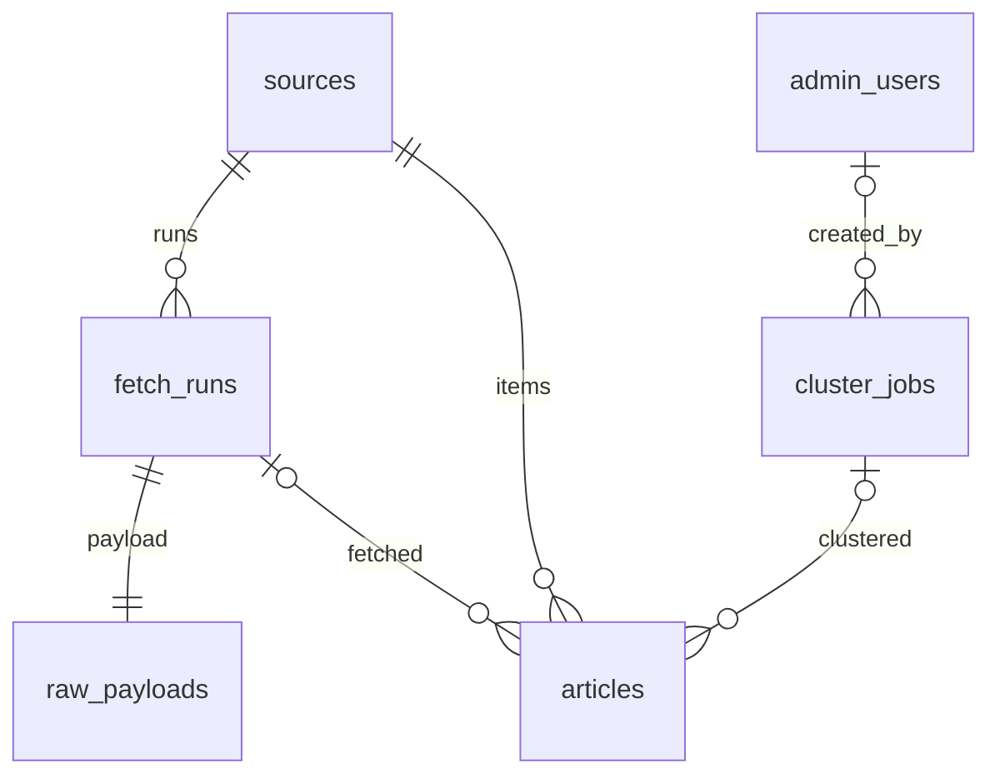

# 07 · 采集管线（RSS 抓取 + template 划版）

规格版本：阶段 4
前置：阶段 1–3 已落地（公开只读 + 管理 CRUD + `/admin` 案头）。**不改** `01`–`05` 已锁字段、表名、状态码。`06` 只补采集路由/文案，不改 CRUD 形状。
本文件是采集限界上下文 **Pipeline** 的唯一规格。实现放 `backend/`，管理 UI 放 `src/app/admin/pipeline`。

技能依据：Clean Architecture（`application/` **禁止** import `adapters/`）；PostgreSQL 3NF + FK 手建索引；REST 管理端 JWT；SSRF 按 `04` 精神落地（本阶段才真正出网）。

## 1. 范围

做：

- 管理员手动触发 RSS/Atom 抓取（https only）
- 解析条目、upsert `articles`、落 `fetch_runs` + `raw_payloads`
- template 划版：把未划文章按 `guess_topic` 合成 **draft** 簇（`section=more`，`rank=null`）
- 进程内定时：上海 `06:30,12:30,18:30` 各跑一轮「全源抓取 + 当天划版」
- 管理 API：`/api/v1/admin/pipeline/*`（JWT），含 `schedule` / `tick`
- 案头页 `/admin/pipeline`
- Alembic `0002_pipeline`
- 5 条种子信源补 `homepageUrl` / `feedUrl`；seed **不出网**

不做：

- LLM 撰写 / 自动付印 / 系统 crontab / 多实例分布式锁
- 改公开契约、公开 JSON 带 URL、公开 Header 挂后台入口
- 微服务、CQRS、Temporal、Redis、对象存储
- 第三方 feed 库（只用 stdlib `xml.etree.ElementTree`）
- 自动 quarantine、按 `fetched_at` 过滤划版、把脉搏改成实时聚合

## 2. 架构 / Ports

同仓模块化单体，新增限界上下文 **Pipeline**。

```
adapters/api/routers/pipeline.py  →  application/pipeline.py  →  domain
adapters/http/{ssrf,fetcher,parser}.py
adapters/pipeline/template_writer.py
adapters/db/pipeline_repositories.py
adapters/memory/repositories.py   # MemoryPipelineRepository
```

依赖方向只向内。`main.py` 是 composition root，可以 import adapters。

Ports（`domain/interfaces.py`）：

| Port | 实现 |
|---|---|
| `HttpFetcher` | memory 默认 `DisabledHttpFetcher`；postgres 默认 `SsrfHttpClient`；测试可注入 `FakeHttpFetcher` |
| `FeedParser` | `XmlFeedParser`（RSS 2.0 + Atom） |
| `StoryWriter` | 默认 `TemplateStoryWriter` |
| `PipelineRepository` | `MemoryPipelineRepository` / `PgPipelineRepository` |

`create_app(settings=None, *, http_fetcher=None)`。`make_client` 必须 `overrides.pop("http_fetcher", None)`，否则进 Settings `extra=ignore` 被丢掉。

`PipelineUseCases` 依赖：admin catalog + admin editorial + pipeline repo + fetcher + parser + writer + clock + identity。application 只 import domain（`timefmt` 同层可用）。

对外键：runs=`sourceCode+startedAt`；articles=`sourceCode+guid`；jobs=`date+createdAt`。**不暴露 BIGINT PK**。

时区 `Asia/Shanghai`。时间戳对外 UTC ISO `Z`。前端双语仍在客户端切；API 始终返回 zh+en（本阶段簇标题在 1 篇时 zh/en 同文）。

## 3. DDL + ERD

PK 一律 `BIGINT GENERATED ALWAYS AS IDENTITY`。建表顺序：`fetch_runs` → `raw_payloads` → `cluster_jobs` → `articles`。删表反序。`briefing_date` **不做** FK（允许先划版再对草稿日）。

```sql
CREATE TABLE fetch_runs (
  id              BIGINT GENERATED ALWAYS AS IDENTITY PRIMARY KEY,
  source_id       BIGINT NOT NULL REFERENCES sources (id) ON DELETE CASCADE,
  status          TEXT NOT NULL,
  feed_url        TEXT NOT NULL,
  http_status     BIGINT,
  bytes_read      BIGINT NOT NULL DEFAULT 0,
  article_count   BIGINT NOT NULL DEFAULT 0,
  error_code      TEXT,
  error_message   TEXT,
  started_at      TIMESTAMPTZ NOT NULL,
  finished_at     TIMESTAMPTZ,
  CONSTRAINT fetch_runs_status_chk CHECK (status IN ('running', 'ok', 'error', 'blocked')),
  CONSTRAINT fetch_runs_feed_url_proto CHECK (feed_url ~ '^https://')
);
CREATE INDEX fetch_runs_source_idx ON fetch_runs (source_id);
CREATE INDEX fetch_runs_started_idx ON fetch_runs (started_at DESC);

CREATE TABLE raw_payloads (
  fetch_run_id    BIGINT PRIMARY KEY REFERENCES fetch_runs (id) ON DELETE CASCADE,
  body            TEXT NOT NULL,
  content_type    TEXT,
  CONSTRAINT raw_payloads_body_len CHECK (LENGTH(body) <= 65536)
);

CREATE TABLE cluster_jobs (
  id              BIGINT GENERATED ALWAYS AS IDENTITY PRIMARY KEY,
  briefing_date   DATE NOT NULL,
  status          TEXT NOT NULL,
  writer          TEXT NOT NULL,
  story_count     BIGINT NOT NULL DEFAULT 0,
  article_count   BIGINT NOT NULL DEFAULT 0,
  created_at      TIMESTAMPTZ NOT NULL,
  created_by      BIGINT REFERENCES admin_users (id) ON DELETE SET NULL,
  CONSTRAINT cluster_jobs_status_chk CHECK (status IN ('ok', 'error')),
  CONSTRAINT cluster_jobs_writer_chk CHECK (writer IN ('template', 'llm'))
);
CREATE INDEX cluster_jobs_date_idx ON cluster_jobs (briefing_date);
CREATE INDEX cluster_jobs_created_idx ON cluster_jobs (created_at DESC);
CREATE INDEX cluster_jobs_created_by_idx ON cluster_jobs (created_by);

CREATE TABLE articles (
  id              BIGINT GENERATED ALWAYS AS IDENTITY PRIMARY KEY,
  source_id       BIGINT NOT NULL REFERENCES sources (id) ON DELETE RESTRICT,
  fetch_run_id    BIGINT REFERENCES fetch_runs (id) ON DELETE SET NULL,
  cluster_job_id  BIGINT REFERENCES cluster_jobs (id) ON DELETE SET NULL,
  guid            TEXT NOT NULL,
  canonical_url   TEXT NOT NULL,
  title           TEXT NOT NULL,
  summary         TEXT NOT NULL,
  lang            TEXT NOT NULL,
  published_at    TIMESTAMPTZ,
  fetched_at      TIMESTAMPTZ NOT NULL,
  CONSTRAINT articles_source_guid_uq UNIQUE (source_id, guid),
  CONSTRAINT articles_url_proto CHECK (canonical_url ~ '^https://'),
  CONSTRAINT articles_lang_chk CHECK (lang IN ('zh', 'en', 'und'))
);
CREATE INDEX articles_source_idx ON articles (source_id);
CREATE INDEX articles_fetch_run_idx ON articles (fetch_run_id);
CREATE INDEX articles_cluster_job_idx ON articles (cluster_job_id);
CREATE INDEX articles_fetched_idx ON articles (fetched_at DESC);
```



`ai_report_app`：新表 DML + 新 IDENTITY 序列 USAGE/SELECT（角色存在才 GRANT）。`delete_source` 先数 `articles`（RESTRICT）再数 citations；有文章 → 409 `Source still has articles.`

## 4. SSRF

`SsrfHttpClient`（stdlib `http.client` / `socket` / `ssl`，`asyncio.to_thread` 包同步 IO）：

- 只 https、只 443；拒绝 userinfo；拒绝 IP 字面量（含公网）
- 先 DNS 再连**已复核** IP；TLS `server_hostname` 仍原 host
- DNS 任一地址私网则整单拒绝
- 挡 RFC1918 + 环回 + 链路本地 + 组播 + 未指定 + 保留 + CGNAT `100.64.0.0/10` + metadata `169.254.169.254` / `fd00:ec2::254` + IPv4-mapped 私网
- Python 3.12 `ipaddress.is_private` **不含** CGNAT，必须手写
- 重定向每跳复核，最多 3；超时 5s；body 1MB；UA `ai-report-fetcher/1.0`
- 错误返回 `HttpFetchResult`，不要抛 500
- 可注入 `resolver=` / `opener=`

错误码：`SSRF_BLOCKED`、`TIMEOUT`、`TLS_ERROR`、`NETWORK_ERROR`、`HTTP_ERROR`、`NETWORK_DISABLED`、`PARSE_ERROR`、`REDIRECT_LIMIT`

`HttpFetchResult.status`：`ok|error|blocked`。`SSRF_BLOCKED` / `NETWORK_DISABLED` → run `blocked`；其余失败 → `error`。

memory 默认 `DisabledHttpFetcher` → `NETWORK_DISABLED`。postgres 默认真客户端。seed 不出网。

## 5. Fetch 规则

- `POST /api/v1/admin/pipeline/fetch` body 可选 `{ "codes": ["openai-blog"] }`
- 空 body / 无 `codes` = 全源；空数组 = 什么都不抓；未知字段 422；未知 code **整单** 422 `Unknown source.`
- 隔离源 skip `quarantined`；无 `feed_url` skip `no_feed`
- semaphore ≈ 4
- 无论成败都写 `raw_payloads`（1:1）；body UTF-8 `replace` 再 clip **65536 字符**；空 body 存 `""`
- 空 feed = ok + `article_count=0`；畸形 XML = error / `PARSE_ERROR`
- upsert `(source_id, guid)` 更新标题/摘要/URL/lang/时间/`fetch_run_id`，**保留** `cluster_job_id`
- 成功：`failures=0`、`status=ok`、`today_count=本轮 article_count`、更新 `last_fetch_at`、detail「抓取正常」/「Fetch ok」
- 失败：failures+1；1 次 `late`，≥2 次 `bad`；**不自动 quarantine**；不改 `today_count`；仍更新 `last_fetch_at`
- 响应：`{ "data": { "runs": [...], "skipped": [{ "code", "reason" }] } }`

## 6. Cluster 规则

- `POST /api/v1/admin/pipeline/cluster` `{ "date": "YYYY-MM-DD" }`
- published 日 **409**，message 精确：`Cannot cluster a published briefing.`
- 没有该日 briefing 就建 **draft**（标题「采集草稿」/「Pipeline draft」，`more_heading`「采集划版」/「Pipeline copy」，lede 空，`published_at=combine_hhmm(day,"07:00")`），**不要 publish**
- 新建草稿可写脉搏快照：`healthy` = `status==ok` 的源数，`total_sources` = 目录长度（不是 mock 26），`zh_en='1 : 1'`；已有草稿 **禁止 COUNT 回填**
- 只吃 `cluster_job_id IS NULL`，按请求日划进该日，**不要按 fetched_at 过滤**
- 0 篇文章也建 job；二次 cluster 不重复写已划文章
- 分组：`guess_topic`（`application/pipeline.py`），默认 `research`。顺序：open-source → agents → chips → policy → robotics → on-device → industry-cn → safety → models → 默认 research。分组 slug **sorted**
- 生成 `section=more`、`rank=null`。slug `{YYYYMMDD}-{seq}-{topicSlug}`（seq 用 `^{prefix}-(\d+)-` 提取）
- 1 篇：原文标题（zh/en 同文）；多篇 `{topic.name} · {n} 条` / `{topic.name.en} · {n} items`
- citation.lang：`und` → `en`；kind = 采集/Fetched；标题/dek clip 200/400
- 空 title 用 `"—"` U+2014
- Writer 默认 template。job 不存 slugs；use case 返回时挂上。GET jobs 不带 slugs

## 7. API

统一成功 `{ "data": ... }`，错误 `{ "error": { "code", "message" } }`。JWT 必带。admin POST 已走 `admin_write` 20/min，pipeline POST 不再加桶。审计：`pipeline.fetch` / `pipeline.cluster`。

### `POST /api/v1/admin/pipeline/fetch`

鉴权：Bearer。Query：无。Body：`{}` 或 `{ "codes": ["openai-blog"] }`。

200：

```json
{
  "data": {
    "runs": [
      {
        "sourceCode": "openai-blog",
        "status": "ok",
        "feedUrl": "https://openai.com/news/rss.xml",
        "httpStatus": 200,
        "bytesRead": 2048,
        "articleCount": 2,
        "errorCode": null,
        "errorMessage": null,
        "startedAt": "2026-09-16T01:00:00Z",
        "finishedAt": "2026-09-16T01:00:01Z"
      }
    ],
    "skipped": [{ "code": "lab-rss", "reason": "quarantined" }]
  }
}
```

memory 默认不出网时 run `status=blocked`，`errorCode=NETWORK_DISABLED`。

401：`{ "error": { "code": "UNAUTHORIZED", "message": "Invalid access token." } }`
422 未知字段：`Unknown field.`
422 未知 code：`Unknown source.`

### `GET /api/v1/admin/pipeline/runs?limit=`

鉴权：Bearer。`limit` 走 `parse_audit_limit`，默认 50，1–200。200：`{ "data": { "items": [run...] } }`。401 同上。

### `GET /api/v1/admin/pipeline/articles?source=&from=&to=`

鉴权：Bearer。`from`/`to` 针对 `fetched_at` 的上海日历日：两个都缺=不按日过滤；只给一个 422；from>to 422。不要复用 `parse_date_range`（缺一即 422 且有 62 天上限）。非法 slug 422；未知但合法 source **空列表 200**。文章可带 `clustered: bool`。

200：

```json
{
  "data": {
    "items": [
      {
        "sourceCode": "openai-blog",
        "guid": "https://openai.com/news/gpt-5",
        "canonicalUrl": "https://openai.com/news/gpt-5",
        "title": "GPT-5",
        "summary": "…",
        "lang": "en",
        "publishedAt": "2026-09-16T00:00:00Z",
        "fetchedAt": "2026-09-16T01:00:01Z",
        "clustered": false
      }
    ]
  }
}
```

### `POST /api/v1/admin/pipeline/cluster`

鉴权：Bearer。Body：`{ "date": "2026-09-16" }`。

200：

```json
{
  "data": {
    "date": "2026-09-16",
    "status": "ok",
    "writer": "template",
    "storyCount": 1,
    "articleCount": 2,
    "createdAt": "2026-09-16T01:05:00Z",
    "createdByEmail": "admin@example.com",
    "slugs": ["20260916-1-models"]
  }
}
```

401 同上。422 缺 date / 未知字段。409 published：`Cannot cluster a published briefing.`

### `GET /api/v1/admin/pipeline/jobs?limit=`

鉴权：Bearer。200 的 item **不带** `slugs`。401/422 同 runs。

### `GET /api/v1/admin/pipeline/schedule`

鉴权：Bearer。Query / Body：无。返回进程内调度快照。`enabled=false` 时 `nextRunAt=null`。

200：

```json
{
  "data": {
    "enabled": true,
    "times": ["06:30", "12:30", "18:30"],
    "timezone": "Asia/Shanghai",
    "autoCluster": true,
    "nextRunAt": "2026-09-16T10:30:00Z",
    "lastTick": null
  }
}
```

401 同上。

### `POST /api/v1/admin/pipeline/tick`

鉴权：Bearer。Body：`{}` 或省略。未知字段 422。手动触发与定时同一条链路：全源 fetch，再按上海当天划版。已付印日 fetch 仍执行，`clusterStatus=skipped_published`。空文章 `skipped_empty`；`PIPELINE_AUTO_CLUSTER=false` 则 `skipped_disabled`。审计 `pipeline.tick`。timeout 前端 120000。

200：

```json
{
  "data": {
    "startedAt": "2026-09-16T01:00:00Z",
    "finishedAt": "2026-09-16T01:00:08Z",
    "trigger": "manual",
    "fetchRunCount": 5,
    "skippedCount": 7,
    "clusterStatus": "ok",
    "storyCount": 2,
    "articleCount": 2,
    "slugs": ["20260916-1-agents", "20260916-2-models"],
    "date": "2026-09-16",
    "errorCode": null,
    "errorMessage": null
  }
}
```

## 8. 种子 URL

只给这 5 个 code 加字段（json.load → 加字段 → `ensure_ascii=False` dump，不要重写中文）：

| code | homepageUrl | feedUrl |
|---|---|---|
| openai-blog | https://openai.com/news | https://openai.com/news/rss.xml |
| hf | https://huggingface.co/blog | https://huggingface.co/blog/feed.xml |
| arxiv | https://arxiv.org/list/cs.AI/recent | https://rss.arxiv.org/rss/cs.AI |
| hn | https://news.ycombinator.com | https://hnrss.org/frontpage |
| verge | https://www.theverge.com | https://www.theverge.com/rss/index.xml |

`seed.py` / `MemoryWorld` 读 `row.get("homepageUrl")` / `feedUrl`，禁止写死 `None`。公开 `source_out` 仍不带 URL。`verify()` 断言 14/53/10/12/1 **不要改**。

## 9. 前端

- `/admin/pipeline` 案头页（`desk-*`）：调度快照 + 立即跑一轮 + 手动抓取/划版
- 左轨 NAV 在 sources 与 audit 之间加「采集」
- `admin-api.ts`：`rawSend` / `authSend` 第 5 参 `timeoutMs`，默认 10000；fetch/cluster/tick **120000**
- 默认 cluster 日 = 系统当天上海日历，`Intl.DateTimeFormat("en-CA", { timeZone: "Asia/Shanghai" })`，**不要填 2026-09-14**
- 公开 Header **不要**挂后台入口
- sources 页 lead 指向采集页

## 10. 测试

- `tests/unit/test_ssrf.py`、`test_feed_parser.py`、`test_cluster.py`、`test_schedule.py`
- `tests/integration/test_pipeline.py`（FakeHttpFetcher 注入 RSS；memory 默认 Disabled；含 schedule/tick）
- 默认 pytest 必须绿；PG 仍 opt-in `AI_REPORT_PG_TEST_URL`
- 划版测试日用 `2026-09-16`（避开 `DRAFT_DAY=2026-09-15` 与种子今日 `2026-09-14`）
- 定时 tick 的划版日 = `shanghai_date(now)`，测试不要写死 2026-09-14

## 11. 威胁对照

| 威胁 | 控制 |
|---|---|
| SSRF / 打内网 / metadata | https+443、DNS 后连复核 IP、挡私网/CGNAT/metadata、禁 IP 字面量、重定向每跳复核 |
| 注入 | 参数化 SQL；slug/date 白名单；禁止拼接 |
| 爆破 | admin POST 20/min；login 5/min 已有 |
| 枚举 | 未知 source 列表 200 空；登录失败不暴露用户是否存在（沿用） |
| 信息泄漏 | 错误无堆栈；不暴露 BIGINT；raw body clip；日志不打 token |
| XXE | ElementTree 默认不解析外部实体；畸形 XML → PARSE_ERROR |
| 容量 | body 1MB、payload 65536 字符、semaphore 4、超时 5s |
| 出网误开 | memory 默认 Disabled；seed 不出网 |

## 12. Out of Scope

LLM writer、系统 crontab、多实例选主、自动 publish、改公开 today、改 `01`–`05`、改脉搏为实时聚合、第三方 feed 库、Redis、用户收藏。

## 13. 进程内调度

单实例 FastAPI lifespan 起 `PipelineScheduler`。**不要**上 Redis / Temporal / OS cron。

环境变量：

| 变量 | 默认 | 说明 |
|---|---|---|
| `PIPELINE_SCHEDULER_ENABLED` | `false` | 本机 postgres 开发应设 `true` |
| `PIPELINE_SCHEDULE` | `06:30,12:30,18:30` | 1–8 个唯一 `HH:MM`，按上海日历排序 |
| `PIPELINE_AUTO_CLUSTER` | `true` | 每轮 fetch 后对上海当天划版 |

规则：

- 到点后跑 `scheduled_tick`：`fetch(None)` → 若 auto_cluster 且有未划文章 → `cluster(上海当天)`
- 已付印日不 500，记 `skipped_published`
- 同一上海分钟只跑一次（防 0.05s 提前触发双发）
- 身份用 `ADMIN_EMAIL` 对应的活跃管理员写审计；缺失则 tick `error/FORBIDDEN`，不抓
- memory 模式默认 `DisabledHttpFetcher`，定时开了也只会产生 `blocked` run
- 真出网必须 `REPOSITORY=postgres`
